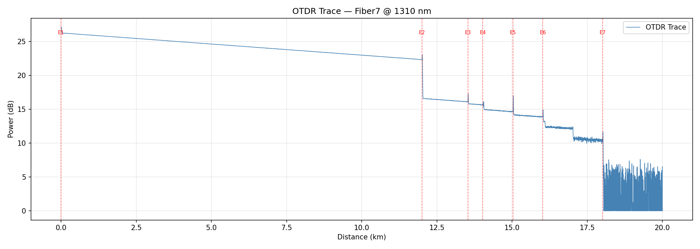
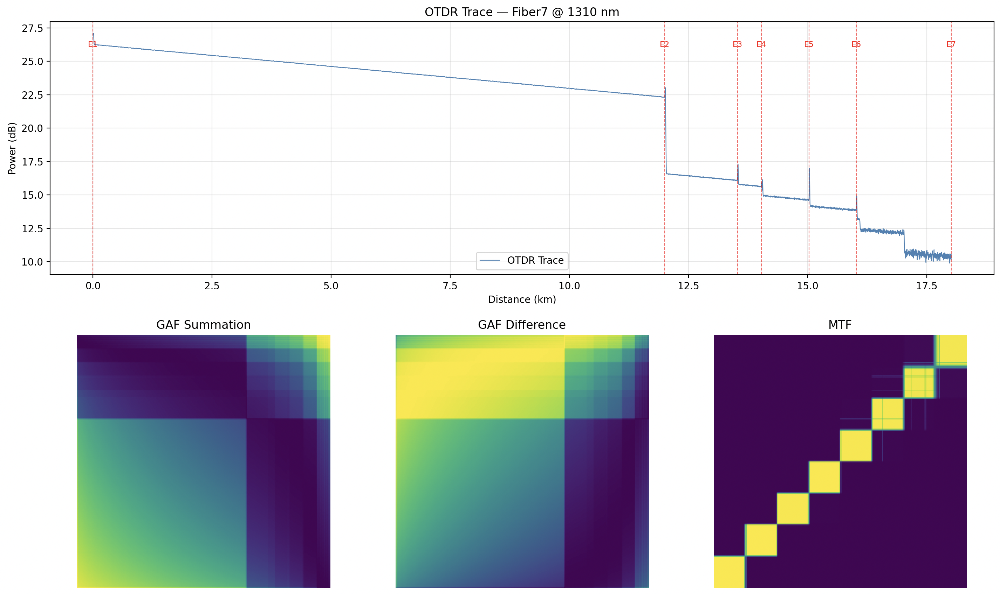

# OTDR Trace Analysis with Representation Learning

Transform optical fiber network traces into deep learning-ready representations for automated analysis, anomaly detection, and predictive maintenance.

##  Overview

This project provides a complete pipeline for processing OTDR (Optical Time-Domain Reflectometry) measurements and converting them into multi-channel image representations suitable for deep learning applications. By transforming 1D fiber signals into 3-channel 2D images using Gramian Angular Fields (GAF) and Markov Transition Fields (MTF), we enable automated fiber health analysis at scale.

### Key Features

- **SOR File Parsing** - Extract trace data, events, and metadata from OTDR .sor files
- **JSON Serialization** - Convert binary OTDR data to structured JSON format
- **Trace Visualization** - Plot OTDR traces with automatic event detection and marking
-  **Multi-Channel Transformation** - Convert 1D signals to 3-channel (224×224) images:
     - GAF Summation - Temporal correlation encoding
     - GAF Difference - Variation and transition highlighting
     - Markov Transition Field - Sequential pattern representation
-  **Batch Processing** - Process entire folders of OTDR measurements automatically
- **CNN-Ready Outputs** - Generate tensors compatible with standard deep learning frameworks


### Create virtual environment

```bash
python -m venv .venv
source .venv/bin/activate

Install all dependencies:
```bash
pip install -r requirements.txt
```

## Quick Start

### 1. Parse OTDR Files

Convert .sor files to JSON format:

```bash
python sor_parser.py
```

**Input:** `.sor` files in `data/otdr_event_classification_training/2022-06-01_otdr_measurements/`  
**Output:** JSON files in `output/parsed_folder/`

Each JSON contains:
- Trace data points (distance, power)
- Event information (splices, connectors, faults)
- Measurement metadata (wavelength, fiber ID, pulse width, etc.)

### 2. Visualize OTDR Traces

Plot traces with detected events:

```bash
python draw_otdr.py
```

**Input:** JSON files from step 1  
**Output:** Interactive matplotlib plots showing:
- Full OTDR trace (distance vs. power)
- Event markers at detected locations
- Fiber metadata in title



### 3. Generate Multi-Channel Image Tensors

Transform traces into 3-channel images for deep learning:

```bash
python sor_to_gaf_mtf.py
```

**Input:** JSON files from step 1  
**Output:** `.npy` files in `output/gaf_mtf_tensors/`

Each .npy file contains a (3, 224, 224) tensor with channels:
1. **Channel 0:** GAF Summation
2. **Channel 1:** GAF Difference  
3. **Channel 2:** Markov Transition Field

### 4. Visualize Individual Channels

Inspect the transformation results:

```bash
python visualize_channel.py
```




**Output:** Visualization showing:
- Top: Original OTDR trace with events
- Bottom: Three image channels side-by-side

## 📁 Project Structure

```
.
├── sor_parser.py              # Parse .sor files → JSON
├── draw_otdr.py               # Visualize OTDR traces
├── sor_to_gaf_mtf.py          # Transform signals → 3-channel images
├── visualize_channel.py       # Visualize transformation results
├── requirements.txt           # Python dependencies
├── otdr_filenames.txt         # List of processed files (180+ traces)
├── trace_plot.png             # Example visualization
│
├── data/                      # Input data (not included)
│   └── otdr_event_classification_training/
│       └── 2022-06-01_otdr_measurements/
│           └── *.sor          # OTDR measurement files
│
└── output/                    # Generated outputs
    ├── parsed_folder/         # JSON files
    └── gaf_mtf_tensors/       # .npy tensor files
```


### Transformation Pipeline

```
1D OTDR Signal (variable length)
        ↓
   Trim to last event (remove noise floor)
        ↓
   Apply GAF + MTF transformations
        ↓
   3-channel image (3, 224, 224)
        ↓
   Ready for CNN input
```


##  Downstream Applications

The generated 3-channel tensors can be used for:

1. **Autoencoder Training** - Learn compact embeddings for fiber traces
2. **Anomaly Detection** - Identify unusual fiber behavior
3. **Event Classification** - Automatically classify splice types, connector types, faults
4. **Similarity Search** - Find traces with similar degradation patterns
5. **Predictive Maintenance** - Forecast fiber failures before they occur
6. **Quality Assessment** - Score fiber link health automatically
7. **Clustering** - Group similar fiber segments for maintenance prioritization


